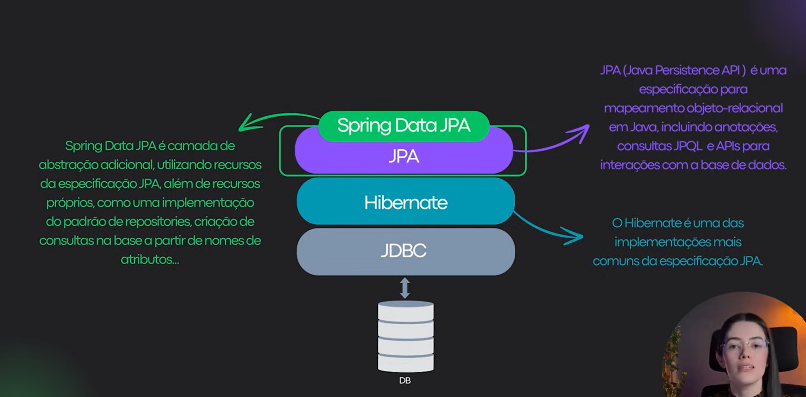
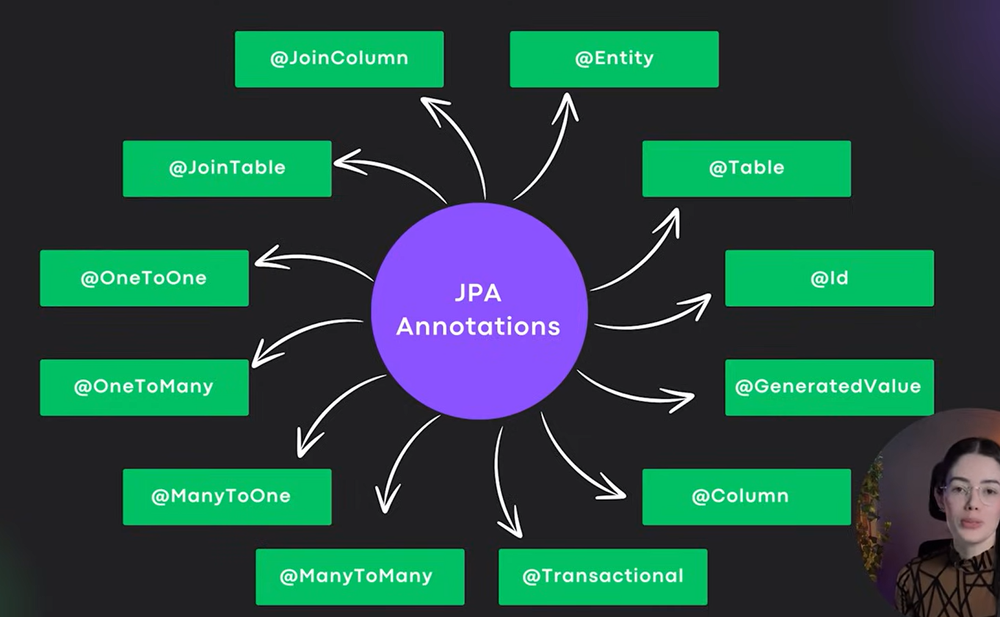
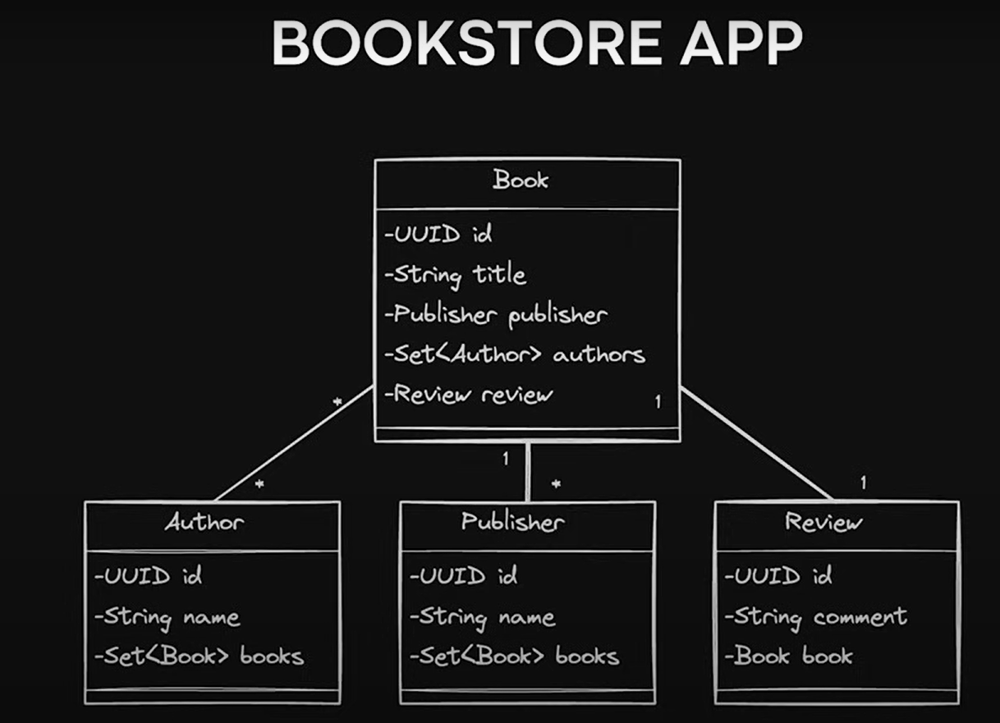
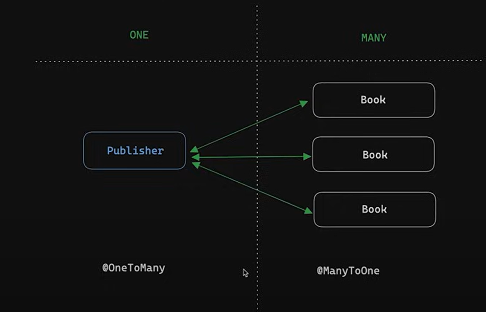
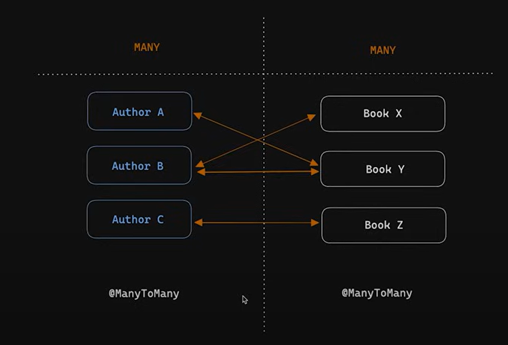
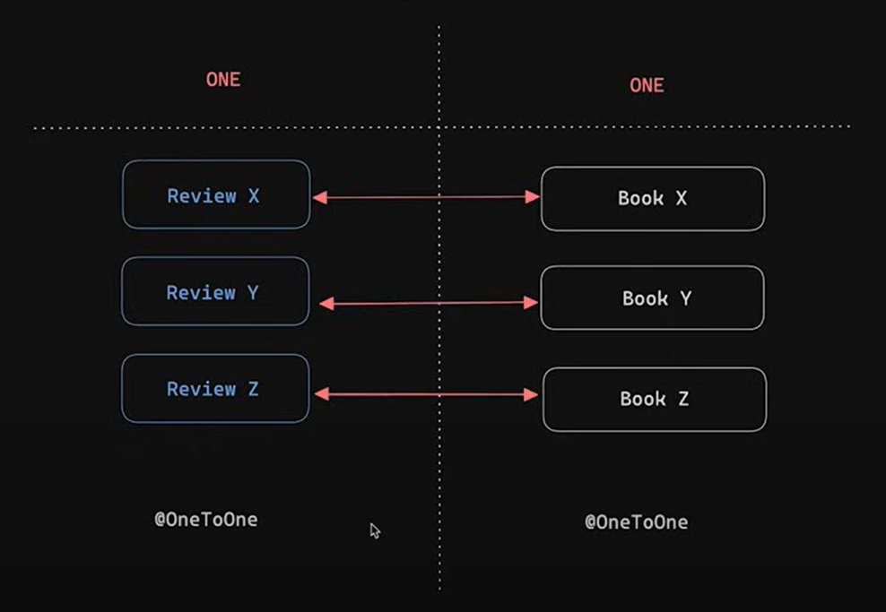

  

* Spring Data JPA simplifica o acesso a **bancos relacionais**, automatizando operações com JPA. 💡

    
Explicação Detalhada - Conceitos

    

        
    

    
Anotações JPA

    

        
    

## Projeto

### Relacionamentos

